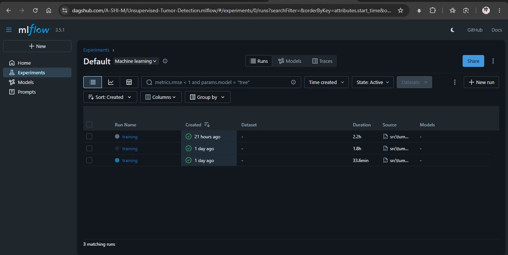
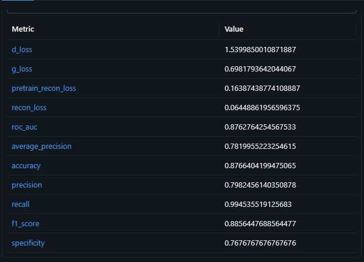
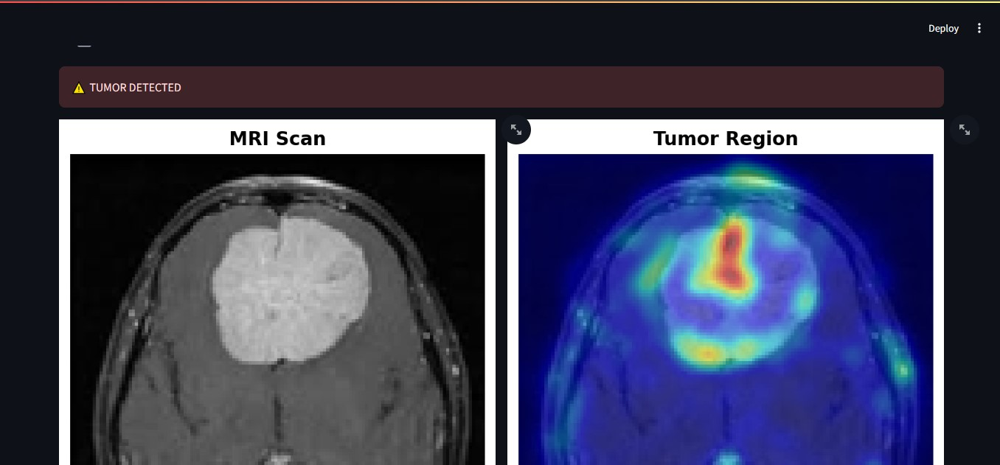
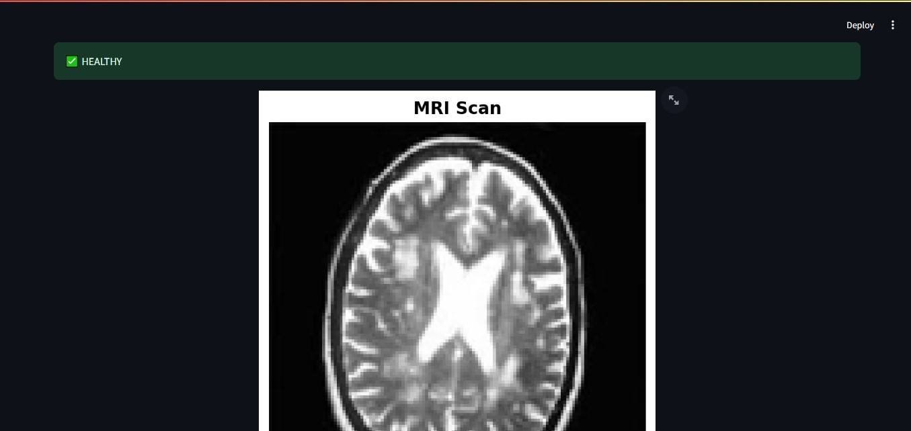
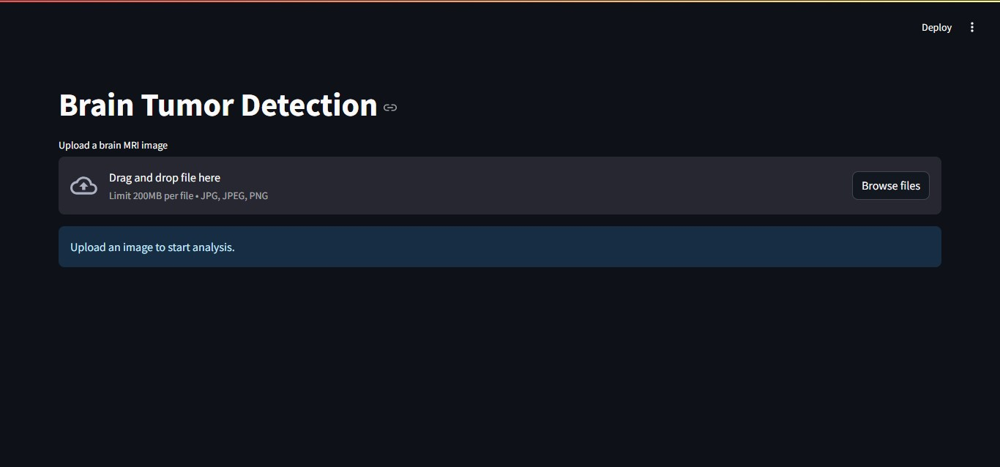

# Unsupervised Brain Tumor Detection using BiGAN

## Table of Contents

- [Project Overview](#project-overview)
- [Setup](#setup)
- [Dataset](#dataset)
- [Data Preprocessing](#data-preprocessing)
- [Model Training](#model-training)
- [Model Evaluation](#model-evaluation)
- [MLflow Experiment Tracking](#mlflow-experiment-tracking)
- [Prediction App](#prediction-app)
- [Course Techniques](#course-techniques)
- [Limitations](#limitations)

---

## Project Overview

### Domain: Healthcare AI

---

### Problem Statement

Brain tumor diagnosis currently relies on the manual inspection of Magnetic Resonance Imaging (MRI) scans by trained radiologists. This process is time-consuming, resource-intensive, and subject to inter-observer variability and human error. Early and accurate detection is critical, as it significantly impacts treatment outcomes and patient survival rates.

Supervised deep learning approaches — while powerful — require large volumes of pixel-level annotated tumor data, which is expensive to produce and scarce in clinical settings due to the need for expert radiologists to label each scan.

This project addresses the problem using **unsupervised anomaly detection**. A Bidirectional Generative Adversarial Network (BiGAN) is trained *exclusively on healthy brain MRI scans*, learning a compact latent representation of normal brain anatomy. During inference, the model attempts to reconstruct any input scan by projecting it through this learned "healthy" manifold. Scans containing tumors — which lie outside the training distribution — yield a higher reconstruction error. This discrepancy serves as an **anomaly score**, enabling tumor detection without ever requiring tumor-labeled training data.

**Key challenge addressed:** Eliminating the dependency on labeled anomaly (tumor) data during training, making the system viable in low-resource clinical environments.

---

### Expected Output

For each input brain MRI scan, the system produces:

- **Tumor Detection** — A prediction of `Healthy` or `Tumor`, determined by comparing the computed anomaly score against a learned optimal threshold.

- **Visual Explanation** (via Streamlit web application):
  - Side-by-side display of the original MRI scan and its BiGAN reconstruction
  - Pixel-level error map overlay highlighting regions of anomalous deviation — providing spatial interpretability of the model's decision

---

## Setup

A reviewer can reproduce the full pipeline from a fresh clone in the following order:

**Step 1: Create a virtual environment with Python 3.12.10**

**Step 2: Install dependencies**
```bash
pip install -r requirements.txt
```

**Step 3: Get a DagHub token**
- Create an account at [dagshub.com](https://dagshub.com)
- Go to User Settings → Tokens → Generate New Token

**Step 4: Create a `.env` file in the project root**
```env
MLFLOW_TRACKING_URI=https://dagshub.com/A-SHI-M/Unsupervised-Tumor-Detection.mlflow
MLFLOW_TRACKING_USERNAME=dagshub-username
MLFLOW_TRACKING_PASSWORD=dagshub-token
```

**Step 5: Run the full pipeline**
```bash
python main.py
```
Downloads data, transforms, trains BiGAN, and evaluates the model.

**Step 6: Inspect MLflow runs on DagHub**

Navigate to: [https://dagshub.com/A-SHI-M/Unsupervised-Tumor-Detection.mlflow/](https://dagshub.com/A-SHI-M/Unsupervised-Tumor-Detection.mlflow/)

**Step 7: Launch the prediction UI**
```bash
streamlit run app.py
```

**Step 8: Build and run the Docker container**
```bash
# Build image
docker build -t tumor-detection:0.1 .

# Run container
docker run -p 8501:8501 tumor-detection:0.1
```

---

## Dataset

**Source:** [Brain MRI — Kaggle (ashimdj89)](https://www.kaggle.com/datasets/ashimdj89/brain-mri)

The dataset was originally downloaded from Kaggle and re-hosted on Google Drive so that the pipeline can be reproduced without Kaggle API credentials. It is downloaded automatically via `gdown` through the data ingestion stage, which is triggered as part of the full pipeline.

**Data Fetching:**

```bash
python src/tumor_detection/pipelines/stage_01_data_ingestion.py
```

Downloads and extracts the dataset automatically into `data/`.

**Google Drive mirror:** `https://drive.google.com/file/d/1cfq70IG4wxvAVPLqGi7RXZPNxZ4LMMhb/view?usp=sharing`

**Description:**

| Class | Images |
|---|---|
| Healthy | 988 |
| Tumor | 913 |
| **Total** | **1,901** |

Format: JPG.

**Why this data fits the task:**

- The unsupervised anomaly detection approach requires a clean set of normal samples for training — the healthy-only training subset provides exactly that boundary condition.
- Withholding all tumor images from training and using them only at evaluation time faithfully simulates a real clinical scenario where labeled anomaly data is unavailable.
- The near-equal class balance (~988 healthy / ~913 tumor) prevents the test set from being skewed, making metrics such as F1 and AUC directly interpretable.

---

## Data Preprocessing

Raw images are processed by the transformation stage before training:

1. **Grayscale conversion** — each image is converted to single-channel grayscale
2. **Resize** — all images are resized to 128×128 pixels
3. **Normalization** — pixel values are scaled to [0, 1] by dividing by 255
4. **Train/test split** — healthy images are split 80/20; all tumor images are reserved for testing only (the model never sees them during training)
5. **Saved as NumPy arrays** — processed splits are saved to `artifacts/data_transformation/` as `X_train.npy`, `X_test.npy`, `y_train.npy`, `y_test.npy`

Run the transformation stage independently:

```bash
python src/tumor_detection/pipelines/stage_02_data_transformation.py
```

---

## Model Training

The model is a **Bidirectional GAN (BiGAN)** comprising three components:

- **Encoder** — maps an input MRI scan to a compact latent vector (128-dim)
- **Generator** — reconstructs an image from a latent vector
- **Discriminator** — validates whether an image–latent pair is real or fake

Training is done in two phases, both using only the healthy training images:

**Phase 1 — Reconstruction Pre-training (150 epochs)**
The encoder and generator are trained together to minimise reconstruction error:
> `Loss = 0.6 × MSE + 0.3 × MAE + 0.1 × (1 − SSIM)`

**Phase 2 — Joint BiGAN Training (500 epochs)**
The full BiGAN is trained adversarially. The discriminator learns to distinguish real image–latent pairs from fake ones, while the encoder and generator jointly learn to fool it.

**Key Hyperparameters:**

| Parameter | Value |
|---|---|
| Image size | 128×128 |
| Latent dimension | 128 |
| Batch size | 32 |
| Reconstruction LR | 0.0001 |
| BiGAN / Discriminator LR | 0.00005 |
| Pre-training epochs | 150 |
| Joint training epochs | 500 |

All runs are tracked via **MLflow** logged to **DagShub** (configured via `.env`).

Run the training stage independently:

```bash
python src/tumor_detection/pipelines/stage_03_model_training.py
```

Trained model weights are saved to `trainedmodels/` as `encoder.keras`, `generator.keras`, and `discriminator.keras`.

---

## Model Evaluation

Each test image is passed through the encoder and generator to produce a reconstruction. The **anomaly score** is computed as:

> `Anomaly Score = 0.7 × MSE(original, reconstruction) + 0.3 × (1 − SSIM)`

Scores above the optimal threshold (`0.1202`) are classified as **Tumor**; below as **Healthy**.

**Results on the held-out test set:**

| Metric | Value |
|---|---|
| ROC AUC | 0.8763 |
| Average Precision | 0.7820 |
| F1 Score | 0.8856 |
| Accuracy | 87.66% |
| Recall (Sensitivity) | 99.45% |
| Specificity | 76.77% |
| Precision | 79.82% |

**Confusion Matrix:**

| | Predicted Healthy | Predicted Tumor |
|---|---|---|
| **Actual Healthy** | 152 (TN) | 46 (FP) |
| **Actual Tumor** | 1 (FN) | 182 (TP) |

The model achieves near-perfect recall (99.45%), missing only 1 tumor out of 183 — prioritising sensitivity over specificity, which is appropriate for a clinical screening tool.

Evaluation plots (ROC curve, precision-recall curve, confusion matrix, anomaly score distributions) are saved to `artifacts/model_evaluation/`.

Run the evaluation stage independently:

```bash
python src/tumor_detection/pipelines/stage_04_model_evaluation.py
```

---

## MLflow Experiment Tracking

All training and evaluation runs are tracked via **MLflow**, logged remotely to **DagShub**.

**Remote tracking UI:**
[https://dagshub.com/A-SHI-M/Unsupervised-Tumor-Detection.mlflow/](https://dagshub.com/A-SHI-M/Unsupervised-Tumor-Detection.mlflow/)

### Logged Parameters

| Parameter | Description |
|---|---|
| `epochs` | Number of joint BiGAN training epochs |
| `pretrain_epochs` | Number of reconstruction pre-training epochs |
| `batch_size` | Training batch size |
| `img_size` | Input image resolution |
| `latent_dim` | Encoder output / latent space dimension |
| `lr_discriminator` | Discriminator learning rate |
| `lr_bigan` | BiGAN learning rate |
| `lr_reconstruction` | Reconstruction model learning rate |
| `optimal_threshold` | Anomaly score threshold selected at evaluation |

### Logged Metrics

| Metric | Stage | Description |
|---|---|---|
| `pretrain_recon_loss` | Phase 1 (per 10 epochs) | Reconstruction loss during pre-training |
| `d_loss` | Phase 2 (per 10 epochs) | Discriminator loss |
| `g_loss` | Phase 2 (per 10 epochs) | BiGAN (generator + encoder) loss |
| `recon_loss` | Phase 2 (per 10 epochs) | Reconstruction loss during joint training |
| `roc_auc` | Evaluation | Area under the ROC curve |
| `average_precision` | Evaluation | Area under the precision-recall curve |
| `accuracy` | Evaluation | Overall classification accuracy |
| `precision` | Evaluation | Fraction of tumor predictions that are correct |
| `recall` | Evaluation | Fraction of actual tumors detected |
| `f1_score` | Evaluation | Harmonic mean of precision and recall |
| `specificity` | Evaluation | Fraction of healthy scans correctly identified |

### Logged Artifacts

- Reconstruction progress images (every 20 pre-training epochs, every 50 joint epochs)
- ROC curve, precision-recall curve, confusion matrix, anomaly score distribution plots
- Saved model weights (`encoder.keras`, `generator.keras`, `discriminator.keras`)
- `metrics.json`

### Screenshots

**Training Runs on DagShub:**



**Training Results:**



---

## Prediction App

### Streamlit (local)

```bash
streamlit run app.py
```

Opens at `http://localhost:8501`.

**How to use:**
1. Click **Browse files** and upload a brain MRI image (JPG, JPEG, or PNG)
2. The app preprocesses the image automatically and runs it through the BiGAN
3. The result is displayed immediately:
   - **Healthy** — shows the uploaded scan with a green confirmation
   - **Tumor Detected** — shows the MRI scan side-by-side with a heatmap overlay highlighting the anomalous region

Sample input images can be found in `data/BRAIN MRI/Healthy/` and `data/BRAIN MRI/Tumor/` after running the data ingestion stage.

### Docker

```bash
# Build image
docker build -t tumor-detection:0.1 .

# Run container
docker run -p 8501:8501 tumor-detection:0.1
```

Opens at `http://localhost:8501`. Upload and use the app identically to the local Streamlit version.

### Screenshots

**Tumor prediction output:**



**Healthy prediction output:**



**Docker app running:**



---

## Course Techniques

| Technique | How it is applied |
|---|---|
| **Generative Adversarial Network (BiGAN)** | Core model — Encoder, Generator, and Discriminator trained adversarially to learn a latent representation of healthy brain anatomy |
| **Unsupervised Anomaly Detection** | Model trained exclusively on healthy scans; tumors are flagged at inference time as reconstructions that deviate from the learned healthy distribution |
| **Custom Loss Function** | Reconstruction loss combines MSE, MAE, and SSIM (weighted 0.6 / 0.3 / 0.1) to capture both pixel-level and structural similarity |
| **Experiment Tracking (MLflow)** | All hyperparameters, per-epoch losses, evaluation metrics, and artifact plots are logged to DagShub via MLflow |
| **UI / API Serving (Streamlit)** | Interactive web app for uploading MRI scans and viewing tumor predictions with heatmap overlays |
| **Containerisation (Docker)** | Full application packaged as a Docker image for reproducible, dependency-free deployment |
| **Evaluation Methods** | ROC-AUC, precision-recall curve, F1 score, sensitivity/specificity, confusion matrix, and SSIM-based anomaly scoring |

---

## Limitations

### Known Weaknesses

- **Low specificity (76.77%)** — the model produces 46 false positives out of 198 healthy test scans, over-flagging healthy tissue as anomalous. This limits its use as a standalone diagnostic tool and requires clinical confirmation for positive results.
- **Small dataset** — approximately 1,900 images in total. The limited size and diversity of the training set constrains the model's ability to generalise to scans from different hospitals, scanners, or patient demographics.
- **No pixel-level segmentation** — the heatmap overlay provides a rough indication of the anomalous region but does not produce a precise tumor boundary or mask.
- **Single MRI modality** — the model was trained on one dataset with a fixed imaging protocol. Performance on scans from different MRI modalities (T1, T2, FLAIR) or acquisition settings is unknown.
- **Threshold selected on the test set** — the optimal threshold (0.1202) was chosen by sweeping over the test set, which risks overfitting the decision boundary to this specific evaluation split.

### Assumptions

- The healthy training images are correctly labelled and contain no tumor tissue.
- All input scans share the same imaging modality, orientation, and intensity range as the training data.
- Tumors manifest as regions that a BiGAN trained on healthy anatomy cannot reconstruct accurately — this holds for well-defined, localised tumors but may break down for diffuse or subtle abnormalities.

### Failure Cases

- **Diffuse or small tumors** — lesions that produce only a marginal increase in reconstruction error may fall below the threshold and be missed (1 false negative was observed in testing).
- **Imaging artifacts** — noise, motion blur, or scanner-specific intensity patterns may be mistaken for anomalies, increasing false positives.
- **Out-of-distribution scans** — MRI images acquired with different protocols or from different scanners are likely to produce elevated reconstruction error even for healthy tissue, causing false positives.

### Possible Future Improvements

- **Enable perceptual loss** — the VGG16-based perceptual model is already implemented in `model/BIGAN.py` but disabled. Enabling it could improve reconstruction quality and anomaly localisation.
- **Larger and more diverse dataset** — incorporating publicly available datasets (e.g., BraTS) across multiple MRI modalities and scanner types would improve generalisation.
- **Pixel-level segmentation** — extending the output to produce a binary tumor mask rather than a classification label and heatmap.
- **Hyperparameter optimisation (HPO)** — currently all hyperparameters are fixed in `params.yaml`; integrating an HPO framework (e.g., Optuna) could improve model performance systematically.
- **Multi-class detection** — distinguishing between different tumor types (e.g., glioma, meningioma, pituitary) rather than binary healthy/tumor classification.
- **Clinical validation** — comparing model predictions against radiologist annotations on an independent clinical dataset to assess real-world reliability.
